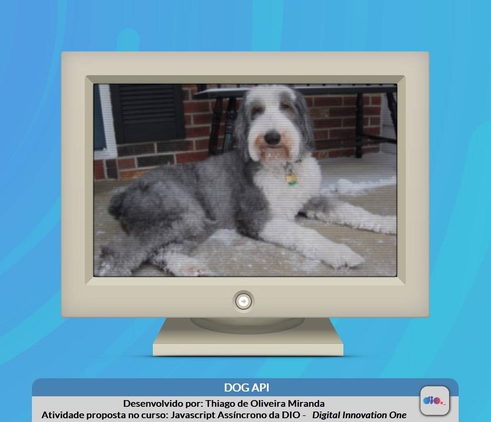

<h3 align="center">

**ATIVIDADE PRÁTICA PROPOSTA NO CURSO DA DIO:JAVASCRIPT ASSÍNCRONO**

</h3>

<h2 align="center">

***DOG Fetch API***

</h2>

<h3 align="center">

**Criado e desenvolvido por:** *Thiago de Oliveira Miranda*

</h3>

***

 

&emsp;&emsp;A atividade prática proposta consistia em criar uma página simples contendo uma *Imagem*  um *Botão* para realizar requisições em um ***API*** ***"Application Programming Interface"***, tendo como premissa a utilização e prática de ***promisses, await e fetch***. O conceito de ***Assincronicidade*** foi explorado para requisitar a troca das imagens diretamente do **API** , e em seguida é retornado o formato **.json** ***"JavaScript Object Notation"*** pela função principal para que sejam coletados os dados de origem e atributos da imagem. Por fim o método ***Catch*** foi implementado para gerar o log de erros.

&emsp;&emsp;O CSS da página foi inspirado no código do dev: Manz.
https://codepen.io/manz/pen/yLbrpGV.
 

***

 

### **Resultado esperado:**

 

Figura 01: Exemplo.

 

***

 

<h2 align="center">

  **RESULTADO OBTIDO**

</h2>

Figura 02: Resultado da atividade.

 

 

***

